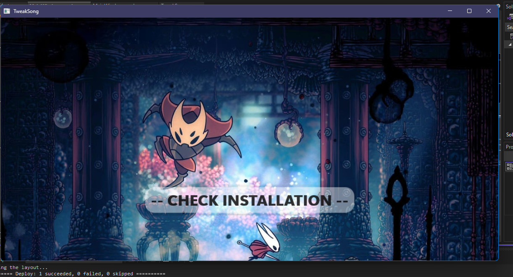

# TweakSong Powered by NexusMods Api

A brand new mod manager for HollowKnight: Silksong will be out soon!
My goal is to make modding Silksong simple.

# How is this different from other managers?

For one thing, the user interface.
It's clean and user friendly. I'm planning to add different themes in the future just for qol.

# Release Date
Tweaksong will most likely be released within the next month or 2, as of 9/18. I will update when I have a for sure date.

ill probably make or commision art for the background of the app later, original image was found on gamerrant it just has some color changes.

